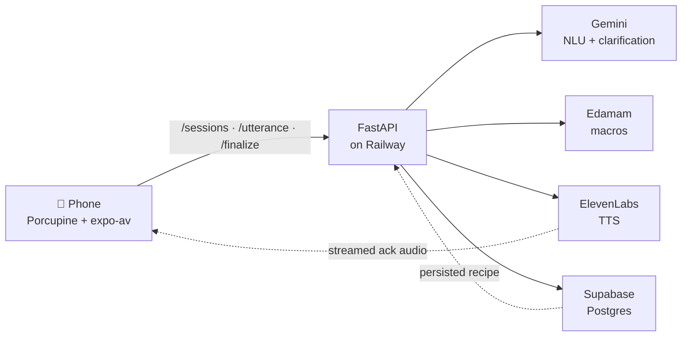
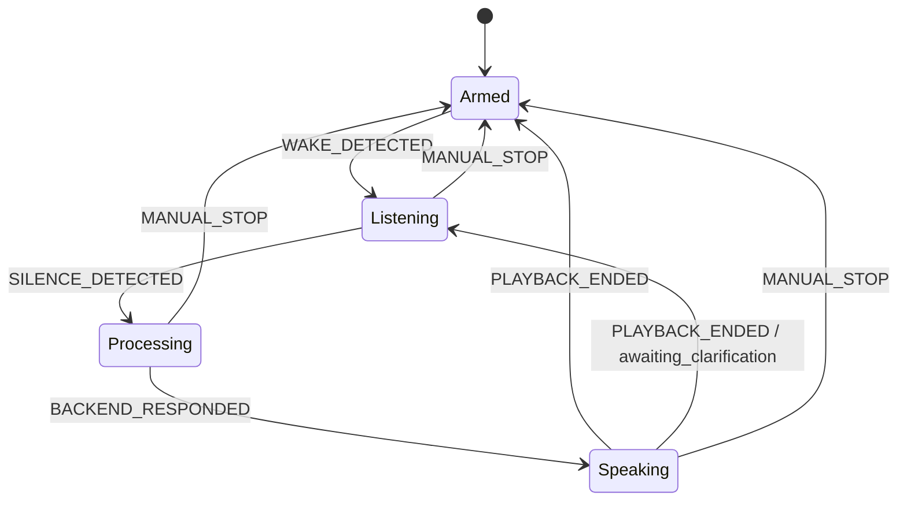

# Sous Chef 🍳

*An AI voice sous chef — tap the mic or say "hey sous", speak your ingredients, and get back macros and a saved cookbook entry. Hands-free, while you cook.*

  

<!-- TODO: add hero.gif at docs/assets/hero.gif (800×450 recommended — MicCard in Listening state with the three gold rings is the money shot) -->

---

## What it is

You're cooking. Your hands are coated in olive oil, your phone is across the counter, and you want to know whether it's okay to swap pecorino for parmesan without drying your fingers on a dish towel for the third time. Recipe apps are the wrong shape for this moment — they want you to read, scroll, and tap.

**Sous Chef** listens. Say "hey Chef", speak what you just added — "four cloves of garlic, minced" — and the app transcribes, parses it into a structured ingredient (`name: garlic`, `qty: 4`, `unit: clove`, `prep: minced`), drops it into the live recipe on screen, and plays a short spoken ack. When you're done, it computes per-ingredient macros via Edamam, saves the recipe to your cookbook, and hands you a summary card.

The technically interesting bits: a four-state voice pipeline that enforces *single audio consumer at a time* (Porcupine and expo-av cannot both hold the mic), Gemini as the NLU layer with a `pending_clarification` round-trip so "add olive oil" can ask "how much?" without losing context, real macro resolution that tolerates per-ingredient failures, and a Warm Editorial design language — cream background, deep kitchen green, gold used exactly twice per session.

Nothing here is mocked for the demo. The `/utterance` path actually ships audio to Gemini, the ack you hear is live ElevenLabs synthesis, the macros on the summary screen are whatever Edamam returns for the ingredients you spoke, and the cookbook row you see at the end is a real Supabase insert. The design doc (`docs/design.md`) and the Warm Editorial style guide (`docs/ui.md`) are the two artifacts that stayed load-bearing from hour zero to hour thirty-six.

## Demo

<!-- TODO: paste demo video URL (YouTube/Loom/Vimeo) -->
**Demo video:** *coming — 3-minute pasta aglio e olio walk-through.*

For judges who want to replay the demo without scrubbing video, here's the exact script:

1. Open the app, tap **Start cooking**. The mic card enters *Armed* — Porcupine is listening in the background.
2. *"Hey Chef, I'm making pasta aglio e olio."* → Chef answers: "Sounds delicious, what did you add?"
3. *"Hey Chef, two tablespoons of olive oil."* → `olive oil · 2 tbsp` lands in the ingredient list.
4. *"Hey Chef, a pinch of red pepper flakes."* → `red pepper flakes · pinch` appears.
5. *"Hey Chef, four cloves of garlic, minced."* → `garlic · 4 clove · minced` appears.
6. *"Hey Chef, what can I use if I don't have parmesan?"* → Q&A intent, spoken answer: "Pecorino Romano or grana padano work well — any hard aged cheese."
7. *"Hey Chef, add eight ounces of spaghetti and half a cup of pasta water."* → two new rows.
8. Tap **Finish cooking**. Summary screen animates in with calories, protein, fat, and carbs, plus the saved cookbook entry.

## Architecture



The phone is the **only** client that talks to the backend; the backend is the **only** server that talks to Gemini, Edamam, ElevenLabs, or Supabase. This keeps secrets off the device and lets us reason about the system as a single orchestrator.

## State machine



Side effects that matter:

- **On `WAKE_DETECTED`:** play a 150ms ding (acoustic confirmation), disarm Porcupine, then start expo-av recording with VAD metering.
- **On `SILENCE_DETECTED`:** 1.5s of sub-threshold audio or a 10s hard cap; stop the recorder and release the iOS audio session back to idle.
- **On `PLAYBACK_ENDED`:** wait **300ms** before re-arming Porcupine. This buffer is empirically necessary — arming any sooner produces a no-audio race on some devices.
- **`awaiting_clarification`:** if Gemini asked a follow-up, skip Armed and go straight back to Listening so the user can answer without re-wake.

## Tech stack

| Role | Tool |
|---|---|
| Wake word | [Picovoice Porcupine](https://picovoice.ai/platform/porcupine/) |
| Mobile framework | [Expo](https://expo.dev) (SDK 54) + [React Native](https://reactnative.dev) 0.81 |
| Mobile language | [TypeScript](https://www.typescriptlang.org) (strict) |
| Routing | [Expo Router](https://docs.expo.dev/router/introduction/) |
| Backend | [FastAPI](https://fastapi.tiangolo.com) on [Railway](https://railway.app) |
| NLU | [Google Gemini](https://ai.google.dev) |
| Voice synthesis | [ElevenLabs](https://elevenlabs.io) |
| Macros | [Edamam Nutrition API](https://developer.edamam.com/edamam-nutrition-api) |
| DB + auth | [Supabase](https://supabase.com) (Postgres) |
| Python pkg mgmt | [uv](https://docs.astral.sh/uv/) |
| JS pkg mgmt | [npm](https://www.npmjs.com/) |

## Quickstart

### Prereqs

- Node 20+
- Python 3.12
- [`uv`](https://docs.astral.sh/uv/getting-started/installation/)
- [Supabase CLI](https://supabase.com/docs/guides/cli)
- [Expo account](https://expo.dev) + EAS CLI (`npm i -g eas-cli`) — required for a dev build with Porcupine
- An iOS device (Porcupine is native-only; Expo Go won't work)

### Backend

```bash
cd backend
uv sync
cp .env.example .env   # fill in keys listed below
uvicorn app.main:app --reload --host 0.0.0.0 --port 8000
```

Swagger at `http://localhost:8000/docs` lets you hit `/sessions` and `/utterance` with sample audio without a phone in the loop.

Required `backend/.env` keys:

- `SUPABASE_URL`, `SUPABASE_SERVICE_KEY` — from [Supabase project settings](https://supabase.com/dashboard)
- `GEMINI_API_KEY` — from [Google AI Studio](https://ai.google.dev)
- `GROQ_API_KEY` — from [Groq](https://console.groq.com) (used by `gemini_client` for fast STT)
- `ELEVENLABS_API_KEY` — from [ElevenLabs profile](https://elevenlabs.io/app/settings/api-keys)
- `EDAMAM_APP_ID`, `EDAMAM_APP_KEY` — from [Edamam developer portal](https://developer.edamam.com/admin/applications)

### Mobile

```bash
cd mobile
npm ci
cp .env.example .env
npx expo start --tunnel --dev-client
```

For a real device with wake word, build once then point Expo at it:

```bash
eas build --profile development --platform ios
# install the resulting .ipa on your phone, then:
npx expo start --tunnel --dev-client
```

Required `mobile/.env` keys:

- `EXPO_PUBLIC_API_BASE_URL` — your backend URL (e.g. `http://192.168.1.x:8000` or the Railway URL)
- `EXPO_PUBLIC_PORCUPINE_ACCESS_KEY` — from [Picovoice Console](https://console.picovoice.ai)
- `EXPO_PUBLIC_MOCK=1` — *optional.* Bypasses Porcupine + backend with local fixtures, so you can iterate on UI in the browser.

### Dev loops

Three loops, in order of cheapest → most faithful. Pick the cheapest that exercises your change.

| Loop | When to use | Command |
|---|---|---|
| **Web (mocked)** | UI work, state machine, reducer changes | `npx expo start`, press `w`. Set `EXPO_PUBLIC_MOCK=1`. |
| **Tunnel on phone** | Real backend + real audio capture, no Porcupine | `npx expo start --tunnel --dev-client`. |
| **Dev build on phone** | Porcupine wake word, full end-to-end | `eas build --profile development --platform ios`, then launch the installed dev client. |

Expo Go will not work — Porcupine is a native module and must be packaged into a dev build.

### Database

```bash
cd backend
supabase db reset   # applies supabase/migrations/* into a fresh DB
```

Migrations are committed SQL under `supabase/migrations/` — we never touch the Supabase dashboard SQL editor, because silent drift between local and remote DBs burned us once already.

### Tests

```bash
# Backend — unit + smoke (hits a real dev Supabase, skips LLM-marked tests)
cd backend && uv run pytest -x

# Mobile — reducer + API client
cd mobile && npm test
```

The backend smoke suite (`backend/tests/smoke/`) is the completion bar: it runs `/sessions → /utterance → /finalize` against a real DB and must pass before any backend change is considered done.

## Project layout

```
sous-chef/
├── backend/
│   ├── app/
│   │   ├── main.py              FastAPI instance + middleware
│   │   ├── routes/              sessions · utterance · finalize · recipes · cookbook · tts
│   │   ├── schemas/             Pydantic request/response models
│   │   ├── db.py                Supabase wrapper
│   │   ├── tts.py               ElevenLabs streaming
│   │   └── nutrition.py         Edamam wrapper
│   ├── gemini_client/           NLU — pure function, owned by Atharva
│   ├── tests/
│   │   ├── smoke/               end-to-end /sessions → /utterance → /finalize
│   │   └── unit/                per-route happy + failure paths
│   ├── pyproject.toml
│   └── uv.lock
├── mobile/
│   ├── app/                     Expo Router screens (home, cooking, summary, cookbook)
│   ├── src/
│   │   ├── audio/               Porcupine · VAD · expo-av recorder · TTS playback
│   │   ├── state/               Armed → Listening → Processing → Speaking reducer
│   │   ├── api/                 typed backend client + mocks
│   │   └── mocks/               fixture utterances for web-mode dev
│   ├── assets/                  hey_sous.ppn · ding.mp3 · icons
│   └── package.json
├── supabase/
│   └── migrations/              versioned SQL (profiles · recipes · ingredients · macro_logs)
├── docs/
│   ├── design.md                authoritative spec
│   └── ui.md                    Warm Editorial style guide
└── .claude/                     scoped skills, memory, and subagent defs for Claude Code
```

## What we built in 36 hours

- [x] End-to-end voice loop: wake word → record → backend → TTS → re-arm
- [x] 150ms ding on wake + 300ms re-arm buffer after TTS (the audio-consumer contract)
- [x] Four-state reducer with clarification re-entry so `pending_clarification` round-trips cleanly
- [x] Gemini as the NLU layer — intent classification + structured ingredient extraction
- [x] Real macro computation via Edamam, per-ingredient + total, resilient to single-ingredient parse failures
- [x] Supabase schema: `profiles`, `recipes`, `ingredients`, `macro_logs` with cascade deletes
- [x] ElevenLabs TTS, streamed + cached via `/tts/stream/{audio_id}`
- [x] Cookbook screen: list past recipes, show cook time, delete with confirmation
- [x] Warm Editorial UI — cream `#FFFDE8` + deep green `#1A472A`, gold `#EFC157` reserved for wake and save
- [x] Mocked dev loop (`EXPO_PUBLIC_MOCK=1`) so UI iteration doesn't require a backend or a phone
- [x] FastAPI Swagger at `/docs` wired up so `/utterance` can be exercised by uploading `.m4a` files directly — no mobile client required for backend iteration

## What we cut (and why)

- **Wake word on web.** Porcupine is native-only; the web build falls back to a tap-to-record button, gated by `EXPO_PUBLIC_MOCK=1`. Good enough for UI iteration; wrong tool for the demo.
- **Multi-user auth.** The demo uses a seeded UUID and RLS is off. Wiring real Supabase auth was a half-day of yak-shaving that wouldn't appear on stage.
- **Streaming Gemini tokens.** Synchronous round-trip is ~1–2s for a typical utterance, which is fast enough. Streaming adds real complexity to the clarification-state machine with no user-visible payoff at this length.

## Challenges we hit

- **Porcupine vs expo-av fighting over the mic.** Both wanted the iOS audio session simultaneously. On arm/disarm races we'd get a live mic card that captured nothing. Fix: a singleton audio manager in `mobile/src/audio/`, explicit `allowsRecordingIOS` toggling on every start/stop, and a non-negotiable 300ms re-arm buffer after TTS playback ends.
- **Gemini clarification-loop state.** Early on, clarifications were stateless — the model would re-ask the same question. Fix: persist `pending_clarification` on the `recipes` row and thread it into the next `/utterance` call so Gemini sees the prior question as context.
- **Edamam tanking whole recipes on one bad ingredient.** A single unparseable phrase (e.g. `"a pinch"`) could 400 the entire nutrition call. Fix: wrap each ingredient in its own `try/except` inside `finalize.py`, log the failure, and return macros for everything that *did* parse. The recipe saves; the user is never blocked.
- **Cache-hostile CLAUDE.md edits.** Midway through the hackathon we noticed the root `CLAUDE.md` was being re-read every turn because we were editing it to jot quick notes. Fix: pinned `CLAUDE.md` as the stable prefix and moved volatile state to `.claude/memory/` and `docs/notes/` — we got the prompt-cache speedup back and saved hours of latency in the final stretch.

## Credits

- **Rishi Dave** — mobile + backend API + integration. [GitHub](https://github.com/Rishi-Dave) · [LinkedIn](https://www.linkedin.com/in/rishi-dave1/)
- **Atharva Nevasekar** — Gemini utterance-understanding client (`backend/gemini_client/`). [GitHub](https://github.com/atharvanev) · [LinkedIn](https://www.linkedin.com/in/atharvanev/)

## License

All rights reserved — hackathon submission.
