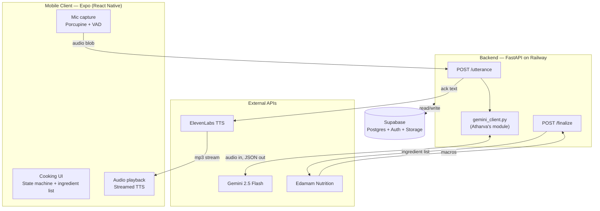
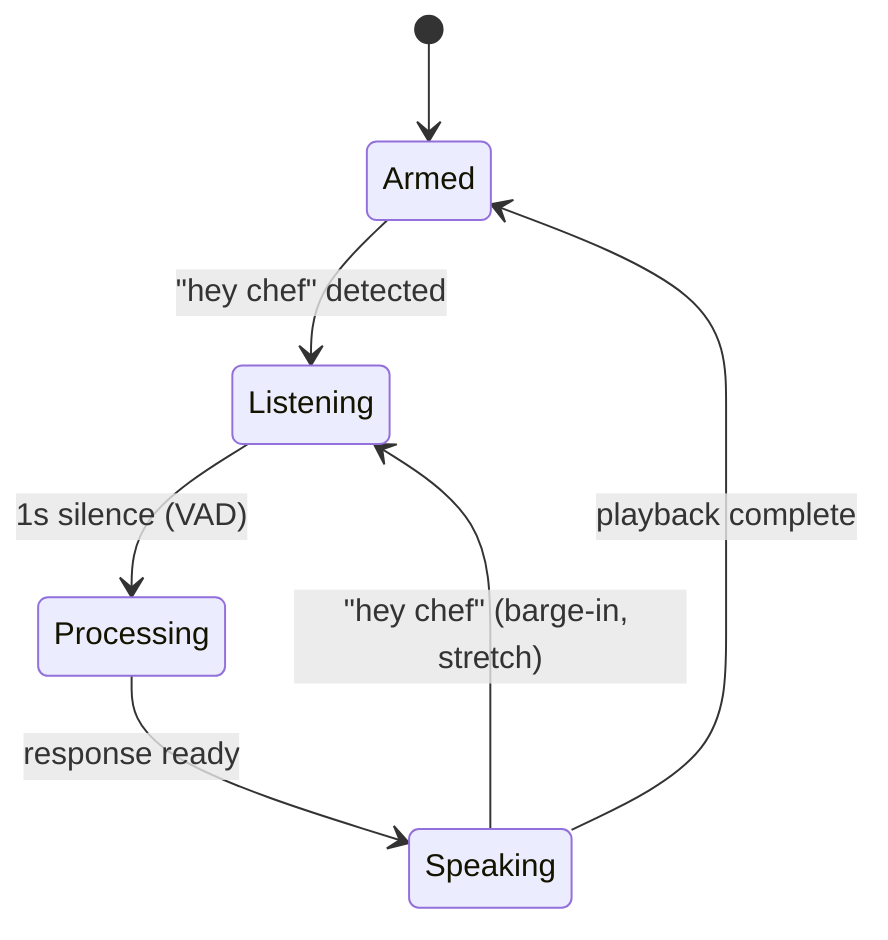
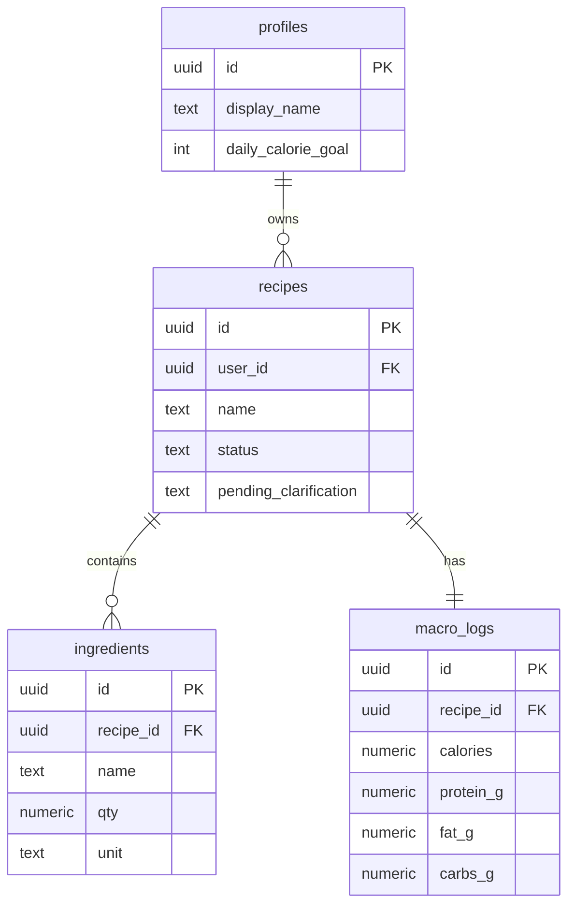

# AI Voice Sous Chef — Design Document

**Team:** Rishi, Atharva
**Target:** Hackathon MVP + demo
**Core stack:** Expo (React Native) · FastAPI · Gemini 2.5 Flash · ElevenLabs · Edamam · Supabase · Picovoice Porcupine

---

## 1. Executive summary

An AI sous chef that listens while you cook. Activated by a "hey chef" wake word, it extracts ingredients and quantities from natural speech, asks clarifying questions when needed, answers cooking Q&A in real time, and computes full macros at the end — saving each recipe to a MyFitnessPal-style summary. No typing, no tapping once cooking starts.

## 2. Scope

### In scope (MVP — "Freestyle Cooking Mode")

- Wake-word activation ("hey chef") with four-state interaction loop
- Continuous voice conversation: add ingredients, ask questions, get spoken responses
- Structured ingredient extraction with clarification flow for ambiguous inputs
- Real-time Q&A (substitutions, techniques)
- End-of-session macro calculation (calories, protein, fat, carbs)
- Recipe + macro persistence
- Summary screen styled like MyFitnessPal

### Explicit non-goals for MVP

- Recipe Mode (stretch #1, only if MVP is rock solid)
- Coach Mode (stretch #2, not starting)
- Multi-user auth beyond a hardcoded demo user
- Image input, pantry tracking, shopping lists
- Background audio / screen-off operation
- Kitchen-noise robustness beyond reasonable ambient

---

## 3. System architecture



**Component responsibilities:**

- **Mobile client** — owns the audio I/O loop and UI. Never talks to Gemini, ElevenLabs, or Edamam directly. One backend is the only server it knows about.
- **Backend** — stateless orchestrator. Holds no per-request state except what's in Postgres. Turns a single audio blob + session context into a structured response + TTS audio.
- **`gemini_client.py`** — Atharva's module. Pure function: `(audio, session_state) → UtteranceResponse`. Imported by the FastAPI backend. Testable in isolation.
- **Supabase** — source of truth for session, ingredient, and macro state. Used directly via `supabase-py` from the backend.

---

## 4. Wake-word state machine



| State | Mic owner | UI indicator | Exit trigger |
|-------|-----------|--------------|--------------|
| **Armed** | Porcupine | Pulsing mic icon | Wake word detected |
| **Listening** | `expo-av` recording | Filled red circle | 1s silence OR 10s max |
| **Processing** | None | Spinner | Backend responds |
| **Speaking** | None | Waveform | TTS playback ends |

**Critical rules:**

1. Only one audio consumer at a time. When transitioning `Armed → Listening`, stop Porcupine *before* starting `expo-av`. When transitioning `Speaking → Armed`, wait 300ms after playback ends before re-arming Porcupine (avoids the app hearing its own "chef" and self-triggering).
2. Play a 150ms "ding" sound immediately on wake-word detection. Users need acoustic confirmation they were heard.
3. Auto-disarm after 20 min of inactivity or when user finalizes the recipe.
4. Keep the screen awake during active sessions (`expo-keep-awake`).

---

## 5. Tech stack

| Layer | Choice | Why |
|-------|--------|-----|
| Mobile framework | **Expo (React Native)** | Single codebase, JS Fast Refresh, EAS Build for native modules |
| Wake word | **Picovoice Porcupine** | On-device, ~50ms detection, free tier, custom wake-word training |
| Audio recording | **`expo-av`** | Standard Expo audio module, works with dev builds |
| Backend | **FastAPI** on **Railway** | Python ecosystem for Gemini/ElevenLabs SDKs, auto-reload dev loop, `/docs` Swagger UI for manual testing |
| LLM | **Gemini 2.5 Flash** (audio input + structured output) | Native audio input removes a separate STT hop; JSON schema mode gives parseable output |
| TTS | **ElevenLabs Turbo v2.5** streaming | ~400ms first-byte latency, high quality |
| Nutrition | **Edamam Nutrition Analysis** | Natural-language endpoint — accepts "2 tbsp olive oil" directly |
| Database | **Supabase** (Postgres + Auth + Storage) | All-in-one, live dashboard useful for demo inspection |
| Deploy | **Railway** (backend) + **EAS** (mobile dev builds) | Zero-config public HTTPS + standard Expo path |

**Explicit non-choices:**
- No vector DB. MVP doesn't need RAG; Gemini handles substitutions from pretraining.
- No separate STT service. Gemini handles audio directly.
- No Redux/Zustand. React Context + `useReducer` is enough for the session state machine.
- No PWA fallback. If Expo setup blocks progress for >3 hours on day 0, revisit. Otherwise commit.

---

## 6. Database schema

```sql
-- Supabase Auth manages auth.users; profiles extends it
CREATE TABLE profiles (
  id UUID PRIMARY KEY REFERENCES auth.users(id),
  display_name TEXT,
  daily_calorie_goal INT,
  created_at TIMESTAMPTZ DEFAULT now()
);

-- One row per cooking session; becomes a saved recipe on finalize
CREATE TABLE recipes (
  id UUID PRIMARY KEY DEFAULT gen_random_uuid(),
  user_id UUID REFERENCES profiles(id),
  name TEXT,
  status TEXT CHECK (status IN ('active','finalized')) DEFAULT 'active',
  pending_clarification TEXT,  -- e.g. "olive_oil_qty" when waiting for user answer
  created_at TIMESTAMPTZ DEFAULT now(),
  finalized_at TIMESTAMPTZ
);

CREATE TABLE ingredients (
  id UUID PRIMARY KEY DEFAULT gen_random_uuid(),
  recipe_id UUID REFERENCES recipes(id) ON DELETE CASCADE,
  name TEXT NOT NULL,
  qty NUMERIC,
  unit TEXT,
  raw_phrase TEXT,            -- original utterance snippet for debugging
  created_at TIMESTAMPTZ DEFAULT now()
);

CREATE TABLE macro_logs (
  id UUID PRIMARY KEY DEFAULT gen_random_uuid(),
  recipe_id UUID UNIQUE REFERENCES recipes(id) ON DELETE CASCADE,
  calories NUMERIC,
  protein_g NUMERIC,
  fat_g NUMERIC,
  carbs_g NUMERIC,
  per_ingredient JSONB,       -- full Edamam response
  computed_at TIMESTAMPTZ DEFAULT now()
);
```



---

## 7. Backend API contract

Lock this in hour 1. Once signed off, both devs build against it. Atharva can fully work against mock responses; Rishi can stand up endpoints returning hardcoded JSON before Gemini integration is done.

### `POST /sessions`

**Request:** `{ "user_id": "uuid" }`
**Response:** `{ "session_id": "uuid", "recipe_id": "uuid" }`

Creates a fresh recipe in `active` status. Returns IDs the mobile client holds for the rest of the session.

### `POST /utterance`

**Request:** multipart/form-data
- `audio`: wav/m4a blob
- `session_id`: uuid

**Response:**
```json
{
  "intent": "add_ingredient | question | acknowledgment | small_talk",
  "ack_audio_url": "https://.../ack.mp3",
  "items": [
    {"name": "olive oil", "qty": 2, "unit": "tbsp", "needs_clarification": false}
  ],
  "answer": null,
  "current_ingredients": [/* full running list */]
}
```

All fields except `intent`, `ack_audio_url`, and `current_ingredients` may be null depending on intent.

### `POST /finalize`

**Request:** `{ "session_id": "uuid", "recipe_name": "Pasta aglio e olio" }`

**Response:**
```json
{
  "recipe_id": "uuid",
  "macros": {"calories": 612, "protein_g": 18.2, "fat_g": 24.1, "carbs_g": 81.0},
  "ingredients": [
    {"name": "olive oil", "qty": 2, "unit": "tbsp",
     "macros": {"calories": 239, "protein_g": 0, "fat_g": 27, "carbs_g": 0}}
  ]
}
```

### `GET /recipes/:id`

Returns full recipe + macros for the summary screen and history.

---

## 8. Gemini interface (Atharva's module)

This is the single Python function Rishi imports. Atharva ships this as a pip-installable local package or a single `.py` file — whatever's simpler.

```python
# gemini_client.py
from pydantic import BaseModel
from enum import Enum

class Intent(str, Enum):
    ADD_INGREDIENT = "add_ingredient"
    QUESTION = "question"
    ACKNOWLEDGMENT = "acknowledgment"
    SMALL_TALK = "small_talk"

class ParsedIngredient(BaseModel):
    name: str
    qty: float | None = None
    unit: str | None = None
    needs_clarification: bool = False
    clarification_question: str | None = None

class UtteranceResponse(BaseModel):
    intent: Intent
    ack: str                    # ≤12 words, spoken back to user
    items: list[ParsedIngredient] | None = None
    answer: str | None = None   # populated when intent=question

async def process_utterance(
    audio_bytes: bytes,
    session_ingredients: list[ParsedIngredient],
    pending_clarification: str | None,
) -> UtteranceResponse:
    """Send audio to Gemini, return structured response."""
    ...
```

### System prompt (Atharva's starting point)

```
You are the brain of an AI sous chef. The user is cooking and speaking to you
through a hands-free interface. They have already said "hey chef" to wake you.

For each audio utterance, classify the intent and return JSON matching the
provided schema.

Intents:
1. add_ingredient — user added an ingredient to their dish
   - Extract name, qty, unit
   - For vague quantities use this table:
     splash=1 tsp, pinch=0.125 tsp, dash=0.5 tsp, drizzle=1 tbsp,
     handful=0.5 cup, to_taste=null (set needs_clarification=false)
   - If qty genuinely unclear, set needs_clarification=true and write a
     short clarification_question

2. question — user asked something about cooking
   - Generate an answer in ≤2 sentences, conversational, no preamble

3. acknowledgment — user is responding to a pending clarification
   - Use pending_clarification context to resolve the original ingredient
   - Return items list with the now-resolved ingredient

4. small_talk — unrelated chatter
   - Brief friendly ack

The `ack` field is what gets spoken back to the user through TTS. Keep it
under 12 words. Never include the answer in `ack` for intent=question —
put it in `answer` and let the caller route it.

Current session ingredients: {session_ingredients}
Pending clarification: {pending_clarification}
```

### Test harness

Atharva should build a test script alongside the module:

```python
# test_utterances.py
TEST_CASES = [
    ("two tablespoons of olive oil", "add_ingredient", "olive oil", 2, "tbsp"),
    ("a splash of olive oil", "add_ingredient", "olive oil", 1, "tsp"),
    ("what can I sub for heavy cream", "question", None, None, None),
    ("uhh some salt I guess", "add_ingredient", "salt", None, None),  # needs_clarification=true
    ("yeah a teaspoon", "acknowledgment", "salt", 1, "tsp"),  # with pending_clarification="salt"
    # ... 10-15 more
]
```

Target: >80% accuracy on this set before integration. Run it again on every prompt change.

---

## 9. MVP feature modules

| Module | Owner | Input | Output | Hard part |
|--------|-------|-------|--------|-----------|
| **M1** — Wake word + mic capture | Rishi | mic stream | audio blob | Porcupine ↔ `expo-av` mic handoff |
| **M2** — Utterance processing | Atharva | audio + session state | `UtteranceResponse` | Intent classification on vague language |
| **M3** — Clarification flow | Rishi + Atharva | `needs_clarification=true` response | `pending_clarification` written to DB | State carried across utterances |
| **M4** — Q&A handler | Atharva | question + ingredient context | `answer` string | Keeping answers short enough for TTS |
| **M5** — Macro computation | Rishi | ingredient list | macros dict | Edge cases where Edamam fails to parse |
| **M6** — Recipe save + summary UI | Rishi | macros + ingredients | MyFitnessPal-style screen | None — just UI work |

---

## 10. Concrete data flow

**Scenario:** User is making pasta aglio e olio.

1. User opens app, taps "Start cooking." Mobile POSTs `/sessions`, gets back `session_id` and `recipe_id`. State machine enters `Armed`. Porcupine starts listening.

2. User says "Hey Chef, I just added two tablespoons of olive oil." Porcupine fires on "Hey Chef" (~50ms). App plays 150ms ding, transitions to `Listening`, starts `expo-av` recording.

3. User finishes speaking. VAD detects 1s of silence. App stops recording, transitions to `Processing`, POSTs the audio blob to `/utterance`.

4. Backend calls `process_utterance(audio, session.ingredients, session.pending_clarification)`. Gemini returns:
   ```json
   {"intent": "add_ingredient",
    "ack": "Got it, two tablespoons of olive oil.",
    "items": [{"name": "olive oil", "qty": 2, "unit": "tbsp"}]}
   ```

5. Backend inserts the ingredient row, sends `ack` text to ElevenLabs streaming endpoint, pipes the MP3 bytes back to mobile. Mobile transitions to `Speaking`, plays audio, appends "olive oil — 2 tbsp" to the live UI list.

6. Playback ends. 300ms pause. Porcupine re-armed. Back to `Armed`.

7. **Ambiguity branch.** User says "Hey Chef, add a splash of olive oil." Same flow, but Gemini applies the vague-quantity table and returns `qty=1, unit="tsp"`. No clarification needed. Ack: "Added a splash — about a teaspoon."

8. **Clarification branch.** User says "Hey Chef, toss in some salt." Gemini returns `needs_clarification=true, clarification_question="How much salt — a pinch, a teaspoon?"`. Backend writes `pending_clarification="salt"` to the recipe row. Ack is the clarification question. User responds "just a pinch." Next `/utterance` call sees `pending_clarification="salt"`, Gemini returns `intent=acknowledgment` with resolved ingredient.

9. **Q&A branch.** User says "Hey Chef, what can I use instead of parmesan?" Gemini returns `intent=question, answer="Pecorino Romano or grana padano work well — any hard aged cheese."`. Backend sends `answer` to ElevenLabs, returns audio. Nothing persisted to ingredients.

10. User taps "Finish cooking." Mobile POSTs `/finalize`. Backend pulls all ingredients from DB, sends them as a single batch to Edamam's `/nutrition-details`, gets back per-ingredient + total macros. Inserts `macro_logs` row, sets recipe status to `finalized`, returns results to mobile. Mobile renders the summary screen.

**Target latency per turn:** <2.5s from end of user speech to start of TTS audio.

---

## 11. Development workflow

Three parallel feedback loops, each for a different kind of iteration.

### Loop 1 — Web browser (Rishi, ~80% of mobile work)

```bash
cd mobile && npx expo start
# press 'w' for web
```

Cooking UI, state machine, ingredient list, finalize screen all render in Chrome with ~100ms hot reload. Mock the slow parts:

```tsx
const MOCK_AUDIO = Platform.OS === 'web' || process.env.EXPO_PUBLIC_MOCK === '1';
const onWakeWord = MOCK_AUDIO ? mockButton : startPorcupine;
const sendUtterance = MOCK_AUDIO ? mockBackend : realBackend;
```

Keep mock responses in `mobile/src/mocks/utterances.json` so they can be cycled through during UI work.

### Loop 2 — FastAPI + Swagger (both devs, all backend work)

```bash
cd backend && uvicorn main:app --reload
# open http://localhost:8000/docs
```

Swagger UI lets either dev upload test audio files, fire real `/utterance` calls, and see real Gemini/ElevenLabs responses. Atharva should keep a `test_audio/` folder checked in with 10–15 reference utterances for reproducible prompt work.

### Loop 3 — Real phone dev build (Rishi, Porcupine integration only)

```bash
cd mobile
eas build --profile development --platform ios
# wait 15-30 min, install on phone
npx expo start --dev-client
```

**Do this in hour 0, not when you need it.** The first EAS build can fail for Apple provisioning reasons and eat hours. Once the dev client is on the phone, JS Fast Refresh still works — you only rebuild for native-code changes, which you shouldn't need after the initial setup.

---

## 12. Parallel implementation plan

**Workflow split:** Rishi does Expo barebones → mobile UI → backend API dev. Atharva owns the Gemini brain as an independent Python module that Rishi imports.

### Interface point

One import statement between the two work streams:

```python
# backend/app/routes/utterance.py
from gemini_client import process_utterance, UtteranceResponse
```

Everything Atharva does is invisible to Rishi until hour ~16, when they integrate. Up to that point Rishi uses a mock:

```python
async def process_utterance(audio, ingredients, pending):
    return UtteranceResponse(intent="add_ingredient", ack="Got it.",
                             items=[ParsedIngredient(name="olive oil", qty=2, unit="tbsp")])
```

### Timeline (assuming ~36-hour hackathon; compress/expand as needed)

| Hour | Rishi | Atharva |
|------|-------|---------|
| **0–2** (setup) | Create Expo project, kick off `eas build` (runs in background), set up Supabase project, deploy empty FastAPI to Railway, share `.env` with keys | Set up Gemini API key, create `gemini_client/` repo, prototype in Jupyter notebook with 5 sample audio files |
| **2–8** (core build) | Mobile shell: navigation, state machine skeleton, Cooking UI with mock ingredient list, hook up Porcupine (install dev build when ready) | Ship v1 of `process_utterance` with real Gemini calls, Pydantic schemas locked, passes >80% on 10 test cases |
| **8–16** (integration-ready) | Finish mic capture + VAD, FastAPI endpoints (`/sessions`, `/utterance`, `/finalize`) wired to Supabase, Edamam integration in `/finalize`, ElevenLabs streaming in `/utterance` | Add clarification flow (pending_clarification context), Q&A intent, expand test set to 20+ utterances, pair-debug with Rishi on any prompt/schema mismatches |
| **16–24** (end-to-end) | **Integration window.** Replace mock `process_utterance` with Atharva's module. Run full loop on real phone. Fix whatever breaks. | Shift to prompt tuning from real failure cases. Help Rishi debug integration. Start thinking about edge cases (overlapping ingredients, corrections) |
| **24–32** (polish) | UI polish (animations for state transitions, waveform visualization, summary screen styling), demo script rehearsal | Final prompt pass, handle the 3-4 worst failure modes from the real tests |
| **32–36** (demo prep) | Record fallback demo video, write demo script, stage dishes for live demo | Support live demo, be ready to hot-fix prompts |

### Dependency map

```
Rishi hour 0–2  ──────────────────┐
                                  ├──► Hour 16 integration
Atharva hour 0–16 ────────────────┘

Hour 16 integration ──► Hour 24 end-to-end working
                         ──► Hour 32 polished
                         ──► Hour 36 demo
```

Nothing blocks until hour 16. If either of you falls behind by hour 12, the other starts helping — the backlog in hour 16 compounds.

---

## 13. Environment setup

### Accounts to create (hour 0, before coding)

- **Picovoice Console** → create access key, train "Hey Chef" wake word → download `.ppn` files for iOS + Android
- **Google AI Studio** → create Gemini API key
- **ElevenLabs** → create account, note API key, pick a voice ID (try "Rachel" or "Adam" for demo)
- **Edamam** → developer account, get `app_id` and `app_key` for Nutrition Analysis API
- **Supabase** → create project, run schema from §6 in SQL editor, note `anon` and `service_role` keys
- **Railway** → create project linked to backend repo, add env vars
- **Expo + EAS** → `npm install -g eas-cli && eas login`

### Repo layout

```
sous-chef/
├── mobile/                      # Rishi
│   ├── app/                     # Expo Router screens
│   ├── src/
│   │   ├── audio/               # Porcupine + VAD + recording
│   │   ├── state/               # Reducer for the state machine
│   │   ├── api/                 # Backend client
│   │   └── mocks/
│   ├── assets/
│   │   ├── hey_chef.ppn
│   │   └── ding.mp3
│   └── eas.json
├── backend/                     # Rishi
│   ├── app/
│   │   ├── main.py
│   │   ├── routes/              # /sessions, /utterance, /finalize
│   │   ├── db.py                # Supabase client
│   │   ├── tts.py               # ElevenLabs wrapper
│   │   └── nutrition.py         # Edamam wrapper
│   ├── gemini_client/           # Atharva's module (submodule or vendored)
│   └── requirements.txt
└── docs/
    └── design.md                # this file
```

### .env template (backend)

```
GEMINI_API_KEY=...
ELEVENLABS_API_KEY=...
ELEVENLABS_VOICE_ID=...
EDAMAM_APP_ID=...
EDAMAM_APP_KEY=...
SUPABASE_URL=...
SUPABASE_SERVICE_ROLE_KEY=...
```

### .env template (mobile)

```
EXPO_PUBLIC_BACKEND_URL=https://sous-chef.up.railway.app
EXPO_PUBLIC_PORCUPINE_KEY=...
EXPO_PUBLIC_MOCK=0
```

---

## 14. Risks and hackathon cuts

### Risks ranked by likelihood

1. **Latency feels bad.** 3s voice round-trip kills demo vibe. Mitigations: warm-up Gemini with a dummy call on session start, use ElevenLabs streaming (don't wait for full audio), keep `ack` under 12 words, deploy backend in a US-West region.
2. **Gemini misclassifies ingredient vs question.** Heavy lift on the prompt. Give it 10+ few-shot examples, especially for the ambiguous cases. Fallback: UI toggle "log ingredient / ask question" buttons if accuracy is bad.
3. **EAS Build fails on day 0.** Apple provisioning, certificate, or bundle ID issues. Budget 2 hours for this in hour 0, not 30 minutes. If still failing at hour 3, switch to Android-only demo.
4. **Porcupine false triggers from kitchen noise.** Tune the sensitivity parameter (start at 0.5). For demo, pick a quiet environment. Keep a visible "tap to speak" fallback button.
5. **Edamam can't parse a weird ingredient.** Wrap in try/except, log the failure, skip that ingredient from macros rather than failing the whole recipe.
6. **Self-triggering (app hears its own TTS say "chef").** Already mitigated: Porcupine is off during `Speaking`. If it still happens, add a 500ms buffer instead of 300ms.

### What to mock / skip if behind

- **Auth** — hardcode a single user UUID. Don't build login.
- **Recipe history page** — defer until polish phase; summary screen is enough.
- **Multi-session concurrency** — sessions are per-device, no real concurrency needed.
- **Barge-in during TTS** — skip unless 6+ hours ahead.
- **Cross-platform polish** — build for iOS only, don't test Android unless extra time.

### Single highest-leverage cut

If you're behind at hour 12: **drop VAD, ship manual stop-speaking**. Wake word triggers recording, user taps a big button to stop. 3 hours saved. Demo still feels magical because the user is still talking to the app naturally.

---

## 15. Demo plan

### Happy path (3 minutes)

1. Open app. Show the clean cooking UI. Tap "Start cooking."
2. Say "Hey Chef, I'm making pasta aglio e olio." → (small talk response) "Sounds delicious, what did you add?"
3. Say "Hey Chef, two tablespoons of olive oil." → ingredient appears on screen.
4. Say "Hey Chef, a pinch of red pepper flakes." → ingredient appears.
5. Say "Hey Chef, four cloves of garlic, minced." → ingredient appears.
6. Say "Hey Chef, what can I use if I don't have parmesan?" → spoken answer about pecorino.
7. Say "Hey Chef, add eight ounces of spaghetti and half a cup of pasta water." → two ingredients appear.
8. Tap "Finish cooking." Summary screen animates in with macros.

### Backup

Pre-recorded screen capture video of the same flow. If live demo fails, play the video, narrate over it. Have it ready by hour 32.

### What to emphasize during the pitch

- **Voice-first UX for an obviously-voice-first use case** (wet hands, busy hands, phone on the counter)
- **Structured extraction from messy natural speech** (the "pinch" / "splash" handling is the wow moment)
- **End-to-end in under 24 hours** (team of two, Gemini + ElevenLabs + Edamam + Supabase)

---

## 16. Stretch features (do not start unless MVP is rock solid)

### Recipe Mode

- User picks a recipe or requests one by name
- AI can fetch via web search (Gemini grounding)
- AI tracks which step the user is on
- "Hey Chef, I chopped the onions, what's next?" → advance to next step

**Estimated cost:** ~6 hours. Requires a recipe state table and step tracker in the backend, plus prompt changes.

### Coach Mode

- User sets macro goals (already in `profiles` schema)
- AI suggests real-time adjustments while cooking
- "Hey Chef, I just added butter" → "You're at 1400 cal of your 1800 goal — want to halve that?"

**Estimated cost:** ~10 hours. Requires user macro history, ingredient-level nutrition lookup during cooking (not just at finalize), and prompt work for the coaching voice. Do not start.

---

## Appendix A — Open questions

- Which ElevenLabs voice ID? Pick before demo, don't change mid-hackathon.
- iOS only or Android + iOS? Default: iOS only.
- Do we show ingredient thumbnails in the UI? Default: no, text list only.
- Do we support deleting an ingredient mid-cook ("Hey Chef, remove the salt")? Default: no for MVP. If a user does this, Gemini will return `small_talk` and nothing changes.

## Appendix B — Commands reference

```bash
# Mobile
cd mobile
npx create-expo-app . --template blank-typescript
npx expo install expo-av expo-keep-awake @picovoice/porcupine-react-native
eas build --profile development --platform ios
npx expo start --dev-client

# Backend
cd backend
python -m venv .venv && source .venv/bin/activate
pip install fastapi uvicorn google-generativeai elevenlabs supabase python-multipart pydantic
uvicorn app.main:app --reload --host 0.0.0.0 --port 8000

# Deploy backend
railway up

# Test Gemini module in isolation (Atharva)
cd backend/gemini_client
python -m pytest test_utterances.py -v
```
